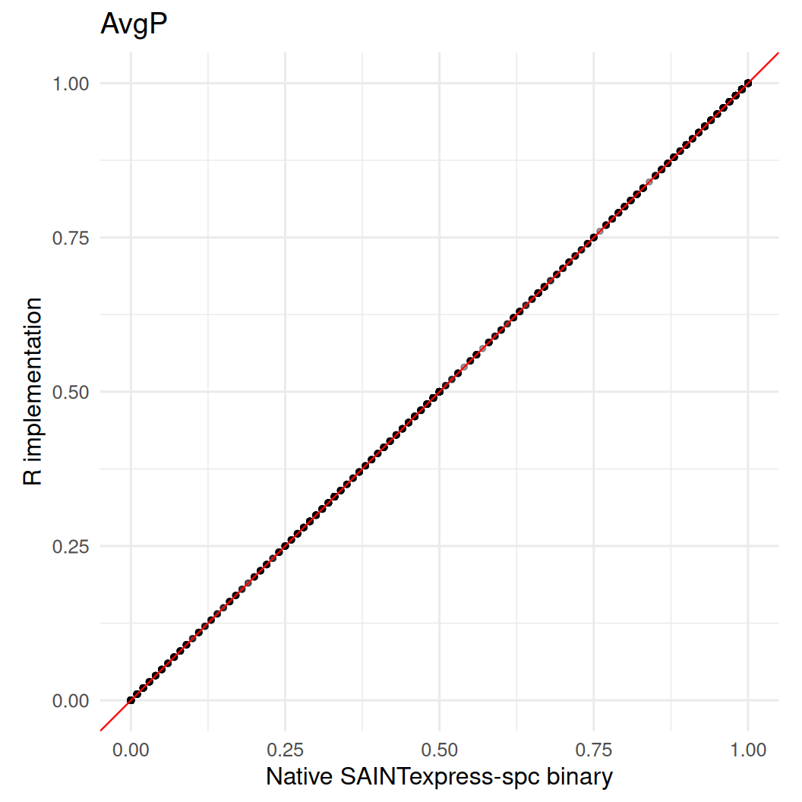
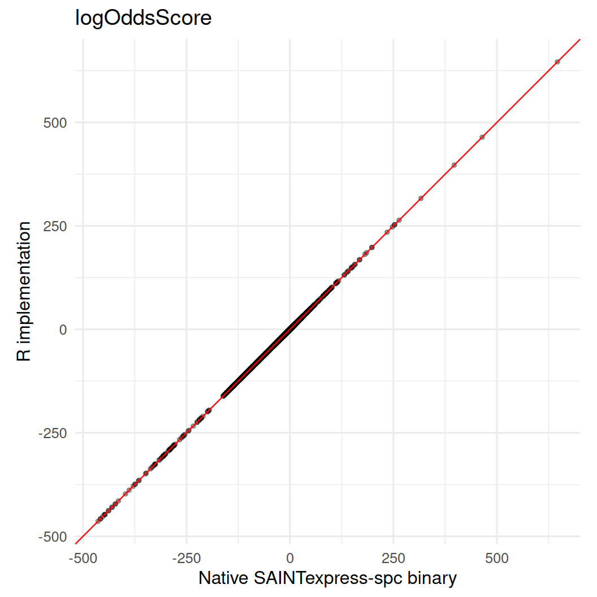
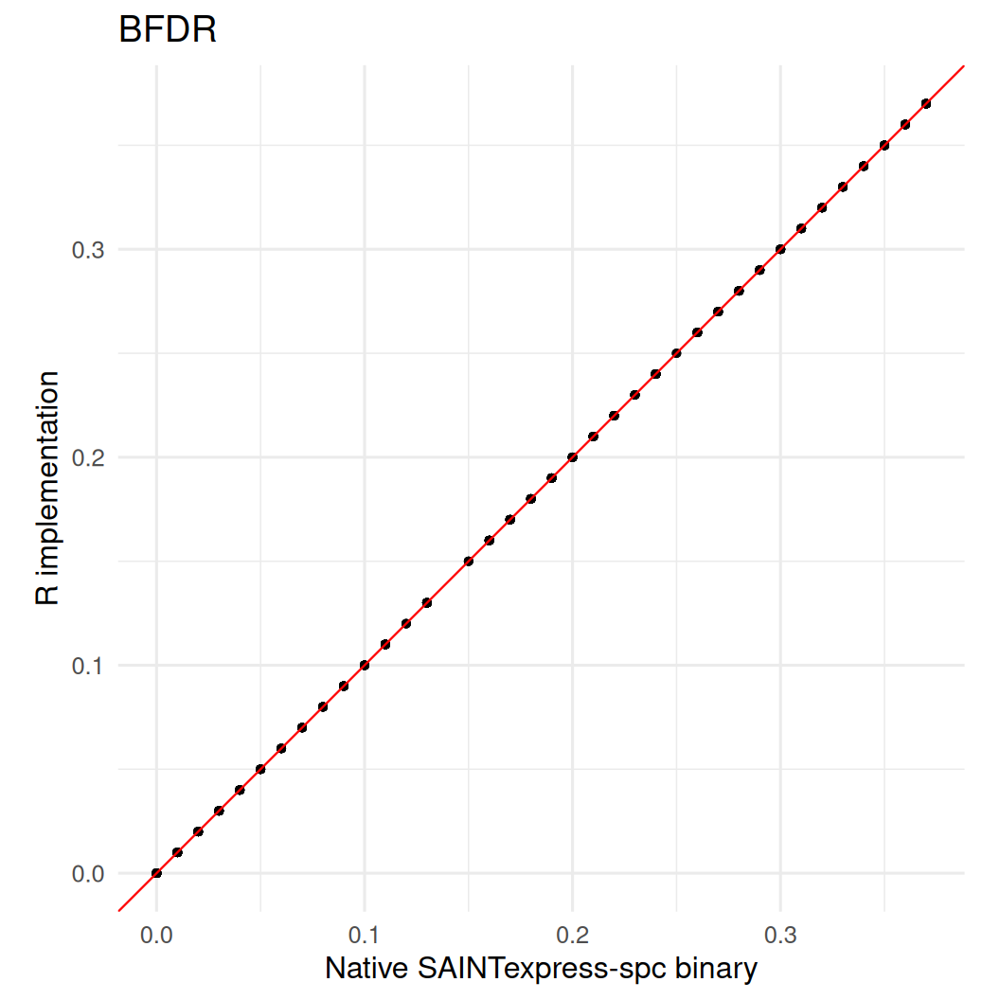

# SAINTexpress-spc: Native Binary vs R Implementation

``` r
library(ggplot2)
library(prolfquasaint)
```

``` r
fixture_dir <- system.file(
  "test/saintexpress-363-tip49-reference-spc",
  package = "prolfquasaint"
)
if (!nzchar(fixture_dir) && file.exists("inst/test/saintexpress-363-tip49-reference-spc")) {
  fixture_dir <- "inst/test/saintexpress-363-tip49-reference-spc"
}
if (!nzchar(fixture_dir) && file.exists("../inst/test/saintexpress-363-tip49-reference-spc")) {
  fixture_dir <- "../inst/test/saintexpress-363-tip49-reference-spc"
}
stopifnot(nzchar(fixture_dir))

si <- list(
  inter = read.delim(
    file.path(fixture_dir, "inter.dat"),
    header = FALSE,
    stringsAsFactors = FALSE,
    check.names = FALSE
  ),
  prey = read.delim(
    file.path(fixture_dir, "prey.dat"),
    header = FALSE,
    stringsAsFactors = FALSE,
    check.names = FALSE
  ),
  bait = read.delim(
    file.path(fixture_dir, "bait.dat"),
    header = FALSE,
    stringsAsFactors = FALSE,
    check.names = FALSE
  )
)
```

``` r
native_binary <- saintexpressbin::saintexpress_executable("spc")
stopifnot(nzchar(native_binary))
native_binary
```

    [1] "/home/runner/work/_temp/Library/saintexpressbin/bin/Linux64/SAINTexpress-spc"

``` r
native_dir <- tempfile("saintexpress-native-")
dir.create(native_dir)

native <- runSaint(
  si,
  filedir = native_dir,
  spc = TRUE,
  engine = "binary",
  use_docker = FALSE,
  CLEANUP = TRUE
)$list
```

    Input files are: /tmp/Rtmpau6vho/saintexpress-native-24f829892c9c/inter.txt, /tmp/Rtmpau6vho/saintexpress-native-24f829892c9c/prey.txt, /tmp/Rtmpau6vho/saintexpress-native-24f829892c9c/bait.txt
    Interaction file: "/tmp/Rtmpau6vho/saintexpress-native-24f829892c9c/inter.txt"
    Prey file: "/tmp/Rtmpau6vho/saintexpress-native-24f829892c9c/prey.txt"
    Bait file: "/tmp/Rtmpau6vho/saintexpress-native-24f829892c9c/bait.txt"
    GO file: ""
    Parsing prey file /tmp/Rtmpau6vho/saintexpress-native-24f829892c9c/prey.txt ...done.
    Parsing prey file /tmp/Rtmpau6vho/saintexpress-native-24f829892c9c/bait.txt ...done.
    Parsing interaction file /tmp/Rtmpau6vho/saintexpress-native-24f829892c9c/inter.txt ...done.
    Setting matrix indices for each interaction...done.
    Creating matrix...done.
    Creating a list of unique interactions...done.

``` r
r_implementation <- runSaint(
  si,
  spc = TRUE,
  engine = "r",
  optimizer = "base"
)$list
```

``` r
key_cols <- c("Bait", "Prey", "PreyGene")
comparison <- merge(
  native,
  r_implementation,
  by = key_cols,
  suffixes = c("_binary", "_r")
)

numeric_cols <- c(
  "AvgP",
  "MaxP",
  "TopoAvgP",
  "TopoMaxP",
  "SaintScore",
  "logOddsScore",
  "FoldChange",
  "BFDR"
)

summary_table <- data.frame(
  metric = numeric_cols,
  n = integer(length(numeric_cols)),
  correlation = numeric(length(numeric_cols)),
  mean_abs_delta = numeric(length(numeric_cols)),
  max_abs_delta = numeric(length(numeric_cols))
)

for (i in seq_along(numeric_cols)) {
  metric <- numeric_cols[[i]]
  binary_values <- comparison[[paste0(metric, "_binary")]]
  r_values <- comparison[[paste0(metric, "_r")]]
  complete <- complete.cases(binary_values, r_values)
  delta <- r_values[complete] - binary_values[complete]
  summary_table$n[[i]] <- sum(complete)
  summary_table$correlation[[i]] <- cor(binary_values[complete], r_values[complete])
  summary_table$mean_abs_delta[[i]] <- mean(abs(delta))
  summary_table$max_abs_delta[[i]] <- max(abs(delta))
}

summary_table
```

            metric    n correlation mean_abs_delta max_abs_delta
    1         AvgP 5521           1   0.000000e+00          0.00
    2         MaxP 5521           1   0.000000e+00          0.00
    3     TopoAvgP 5521           1   0.000000e+00          0.00
    4     TopoMaxP 5521           1   0.000000e+00          0.00
    5   SaintScore 5521           1   0.000000e+00          0.00
    6 logOddsScore 5521           1   1.992393e-05          0.01
    7   FoldChange 5521           1   0.000000e+00          0.00
    8         BFDR 5521           1   0.000000e+00          0.00

``` r
for (metric in numeric_cols) {
  binary_col <- paste0(metric, "_binary")
  r_col <- paste0(metric, "_r")
  plot_data <- comparison[complete.cases(comparison[c(binary_col, r_col)]), ]
  range_values <- range(c(plot_data[[binary_col]], plot_data[[r_col]]), finite = TRUE)

  cat("##", metric, "\n\n")
  print(
    ggplot(plot_data, aes(x = .data[[binary_col]], y = .data[[r_col]])) +
      geom_point(alpha = 0.35, size = 1) +
      geom_abline(slope = 1, intercept = 0, color = "red", linewidth = 0.4) +
      coord_equal(xlim = range_values, ylim = range_values) +
      labs(
        x = "Native SAINTexpress-spc binary",
        y = "R implementation",
        title = metric
      ) +
      theme_minimal(base_size = 12)
  )
  cat("\n\n")
}
```

## AvgP



## MaxP


## TopoAvgP


## TopoMaxP


## SaintScore


## logOddsScore



## FoldChange


## BFDR


