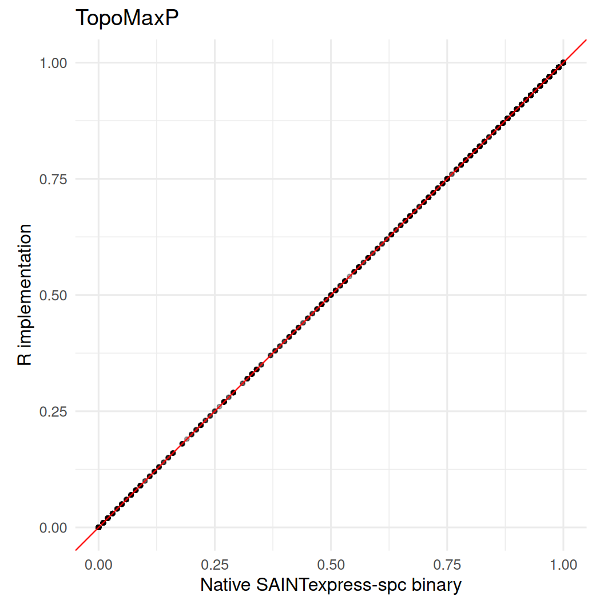
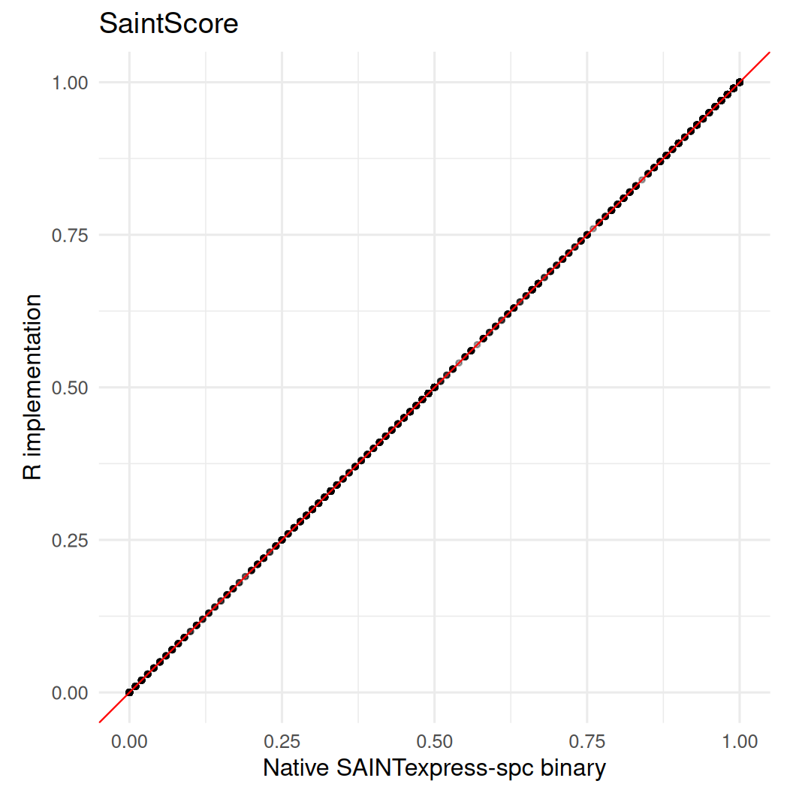
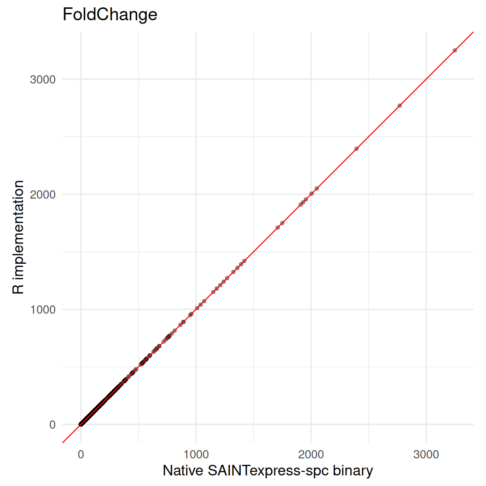

# SAINTexpress-spc: Native Binary vs R Implementation

``` r
fixture_dir <- system.file(
  "test/saintexpress-363-tip49-reference-spc",
  package = "prolfquasaint"
)
if (!nzchar(fixture_dir) && file.exists("inst/test/saintexpress-363-tip49-reference-spc")) {
  fixture_dir <- "inst/test/saintexpress-363-tip49-reference-spc"
}
if (!nzchar(fixture_dir) && file.exists("../inst/test/saintexpress-363-tip49-reference-spc")) {
  fixture_dir <- "../inst/test/saintexpress-363-tip49-reference-spc"
}
stopifnot(nzchar(fixture_dir))

si <- list(
  inter = read.delim(
    file.path(fixture_dir, "inter.dat"),
    header = FALSE,
    stringsAsFactors = FALSE,
    check.names = FALSE
  ),
  prey = read.delim(
    file.path(fixture_dir, "prey.dat"),
    header = FALSE,
    stringsAsFactors = FALSE,
    check.names = FALSE
  ),
  bait = read.delim(
    file.path(fixture_dir, "bait.dat"),
    header = FALSE,
    stringsAsFactors = FALSE,
    check.names = FALSE
  )
)
```

``` r
native_binary <- saintexpressbin::saintexpress_executable("spc")
stopifnot(nzchar(native_binary))
native_binary
#> [1] "/home/runner/work/_temp/Library/saintexpressbin/bin/Linux64/SAINTexpress-spc"
```

``` r
native_dir <- tempfile("saintexpress-native-")
dir.create(native_dir)

native <- prolfquasaint::runSaint(
  si,
  filedir = native_dir,
  spc = TRUE,
  engine = "binary",
  use_docker = FALSE,
  CLEANUP = TRUE
)$list

r_implementation <- prolfquasaint::runSaint(
  si,
  spc = TRUE,
  engine = "r",
  optimizer = "base"
)$list
```

``` r
key_cols <- c("Bait", "Prey", "PreyGene")
comparison <- merge(
  native,
  r_implementation,
  by = key_cols,
  suffixes = c("_binary", "_r")
)

numeric_cols <- c(
  "AvgP",
  "MaxP",
  "TopoAvgP",
  "TopoMaxP",
  "SaintScore",
  "logOddsScore",
  "FoldChange",
  "BFDR"
)

summary_table <- data.frame(
  metric = numeric_cols,
  n = integer(length(numeric_cols)),
  correlation = numeric(length(numeric_cols)),
  mean_abs_delta = numeric(length(numeric_cols)),
  max_abs_delta = numeric(length(numeric_cols))
)

for (i in seq_along(numeric_cols)) {
  metric <- numeric_cols[[i]]
  binary_values <- comparison[[paste0(metric, "_binary")]]
  r_values <- comparison[[paste0(metric, "_r")]]
  complete <- complete.cases(binary_values, r_values)
  delta <- r_values[complete] - binary_values[complete]
  summary_table$n[[i]] <- sum(complete)
  summary_table$correlation[[i]] <- cor(binary_values[complete], r_values[complete])
  summary_table$mean_abs_delta[[i]] <- mean(abs(delta))
  summary_table$max_abs_delta[[i]] <- max(abs(delta))
}

summary_table
#>         metric    n correlation mean_abs_delta max_abs_delta
#> 1         AvgP 5521           1   0.000000e+00          0.00
#> 2         MaxP 5521           1   0.000000e+00          0.00
#> 3     TopoAvgP 5521           1   0.000000e+00          0.00
#> 4     TopoMaxP 5521           1   0.000000e+00          0.00
#> 5   SaintScore 5521           1   0.000000e+00          0.00
#> 6 logOddsScore 5521           1   1.992393e-05          0.01
#> 7   FoldChange 5521           1   0.000000e+00          0.00
#> 8         BFDR 5521           1   0.000000e+00          0.00
```

``` r
for (metric in numeric_cols) {
  binary_col <- paste0(metric, "_binary")
  r_col <- paste0(metric, "_r")
  plot_data <- comparison[complete.cases(comparison[c(binary_col, r_col)]), ]
  range_values <- range(c(plot_data[[binary_col]], plot_data[[r_col]]), finite = TRUE)

  cat("##", metric, "\n\n")
  print(
    ggplot2::ggplot(
      plot_data,
      ggplot2::aes(x = .data[[binary_col]], y = .data[[r_col]])
    ) +
      ggplot2::geom_point(alpha = 0.35, size = 1) +
      ggplot2::geom_abline(slope = 1, intercept = 0, color = "red", linewidth = 0.4) +
      ggplot2::coord_equal(xlim = range_values, ylim = range_values) +
      ggplot2::labs(
        x = "Native SAINTexpress-spc binary",
        y = "R implementation",
        title = metric
      ) +
      ggplot2::theme_minimal(base_size = 12)
  )
  cat("\n\n")
}
```

## AvgP


## MaxP


## TopoAvgP


## TopoMaxP



## SaintScore



## logOddsScore


## FoldChange



## BFDR


## Session information

``` r
sessionInfo()
#> R version 4.6.0 (2026-04-24)
#> Platform: x86_64-pc-linux-gnu
#> Running under: Ubuntu 24.04.4 LTS
#> 
#> Matrix products: default
#> BLAS:   /usr/lib/x86_64-linux-gnu/openblas-pthread/libblas.so.3 
#> LAPACK: /usr/lib/x86_64-linux-gnu/openblas-pthread/libopenblasp-r0.3.26.so;  LAPACK version 3.12.0
#> 
#> locale:
#>  [1] LC_CTYPE=C.UTF-8       LC_NUMERIC=C           LC_TIME=C.UTF-8       
#>  [4] LC_COLLATE=C.UTF-8     LC_MONETARY=C.UTF-8    LC_MESSAGES=C.UTF-8   
#>  [7] LC_PAPER=C.UTF-8       LC_NAME=C              LC_ADDRESS=C          
#> [10] LC_TELEPHONE=C         LC_MEASUREMENT=C.UTF-8 LC_IDENTIFICATION=C   
#> 
#> time zone: UTC
#> tzcode source: system (glibc)
#> 
#> attached base packages:
#> [1] stats     graphics  grDevices utils     datasets  methods   base     
#> 
#> loaded via a namespace (and not attached):
#>  [1] tidyselect_1.2.1       viridisLite_0.4.3      dplyr_1.2.1           
#>  [4] farver_2.1.2           S7_0.2.2               prolfquasaint_0.1.5   
#>  [7] fastmap_1.2.0          lazyeval_0.2.3         digest_0.6.39         
#> [10] rpart_4.1.27           prolfqua_1.6.2         lifecycle_1.0.5       
#> [13] survival_3.8-6         statmod_1.5.2          magrittr_2.0.5        
#> [16] compiler_4.6.0         rlang_1.2.0            tools_4.6.0           
#> [19] yaml_2.3.12            data.table_1.18.4      knitr_1.51            
#> [22] labeling_0.4.3         htmlwidgets_1.6.4      bit_4.6.0             
#> [25] plyr_1.8.9             RColorBrewer_1.1-3     withr_3.0.2           
#> [28] purrr_1.2.2            nnet_7.3-20            grid_4.6.0            
#> [31] saintexpress_0.0.1     jomo_2.7-6             mice_3.19.0           
#> [34] ggplot2_4.0.3          scales_1.4.0           iterators_1.0.14      
#> [37] MASS_7.3-65            cli_3.6.6              crayon_1.5.3          
#> [40] UpSetR_1.4.1           rmarkdown_2.31         reformulas_0.4.4      
#> [43] generics_0.1.4         otel_0.2.0             httr_1.4.8            
#> [46] tzdb_0.5.0             minqa_1.2.8            operator.tools_1.6.3.1
#> [49] splines_4.6.0          parallel_4.6.0         vctrs_0.7.3           
#> [52] boot_1.3-32            glmnet_5.0             Matrix_1.7-5          
#> [55] jsonlite_2.0.0         saintexpressbin_0.0.1  hms_1.1.4             
#> [58] bit64_4.8.2            mitml_0.4-5            ggrepel_0.9.8         
#> [61] foreach_1.5.2          limma_3.68.4           plotly_4.12.0         
#> [64] tidyr_1.3.2            glue_1.8.1             nloptr_2.2.1          
#> [67] pan_1.9                codetools_0.2-20       shape_1.4.6.1         
#> [70] gtable_0.3.6           lme4_2.0-1             tibble_3.3.1          
#> [73] pillar_1.11.1          htmltools_0.5.9        R6_2.6.1              
#> [76] Rdpack_2.6.6           formula.tools_1.7.1    vroom_1.7.1           
#> [79] evaluate_1.0.5         lattice_0.22-9         readr_2.2.0           
#> [82] rbibutils_2.4.1        backports_1.5.1        pheatmap_1.0.13       
#> [85] broom_1.0.13           Rcpp_1.1.1-1.1         gridExtra_2.3         
#> [88] nlme_3.1-169           mgcv_1.9-4             logistf_1.26.1        
#> [91] xfun_0.58              forcats_1.0.1          pkgconfig_2.0.3
```
